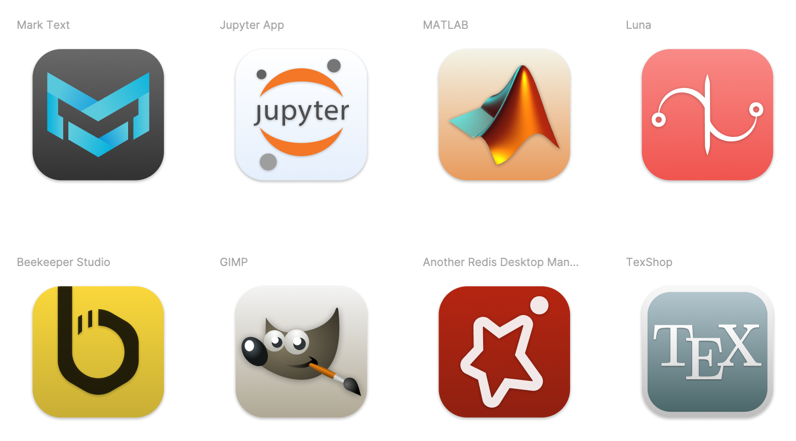

# Icons for macOS Big Sur

## What dis?

This repo contains svg files for a few macOS Big Sur icon replacements.

To get the icns files, go to [https://macosicons.com/](https://macosicons.com/).

If you wish to have an icon for a particular app, please file an issue.

## How to use?

[Here](https://github.com/elrumo/macOS_Big_Sur_icons_replacements/blob/master/README.md#how-do-i-change-the-app-icon-on-my-mac) is how to.

## Icons

Currently, the repo contains icons for the following apps:

- Another Redis Desktop Manager
- Beekeeper Studio
- GIMP
- Jupyter App
- Luna
- Mark Text
- MATLAB
- TexShop
