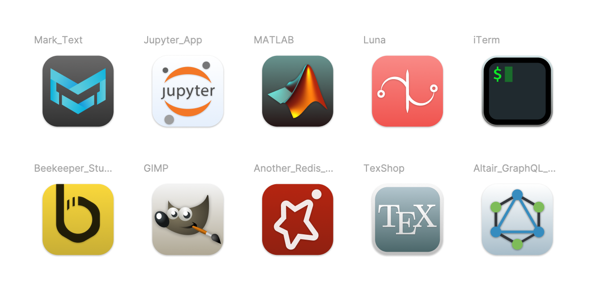
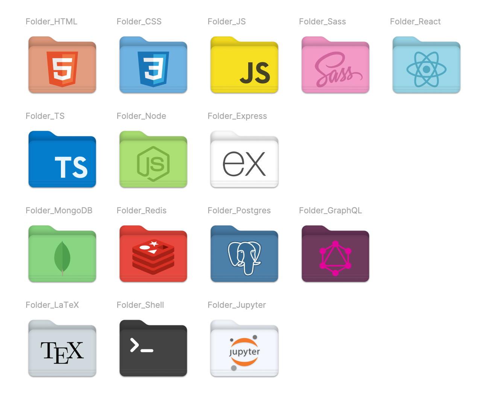

# Icons for macOS Big Sur

## App icons

## Folder icons

## What dis?

This repo contains `svg` and `icns` icon files for a few apps. These icons are destined to replace the older ones to fit macOS Big Sur style.

Also contains icons for folders, use them to keep your stuff organized 😉.

`index.js` builds the `icns` files from the `png` ones. Maybe next commit I will add code to convert directly from `svg`...

## Icon Requests

If you wish to have a particular icon, search here [macOS icon pack - beautiful open source icons for Big Sur](https://macosicons.com/). If you can't find what you want, please file an issue for the request.

## How to use?

1. Head over to your Apps folder
2. Right-click on the app you want to change the icon for
3. Select 'Get Info'
4. Drag and drop the `icns` file on the icon that appears on the top-left, done

## App icons list

Currently, the repo contains icons for the following apps:

- Altair GraphQL Client
- Another Redis Desktop Manager
- Beekeeper Studio
- GIMP
- Jupyter App
- Luna
- Mark Text
- MATLAB
- TexShop
- iTerm

## Folder icons list

And folder icons for the following technologies:

- TS
- Shell
- Sass
- Redis
- React
- Postgres
- Node
- MongoDB
- LaTeX
- Jupyter
- JS
- HTML
- GraphQL
- Express
- CSS
